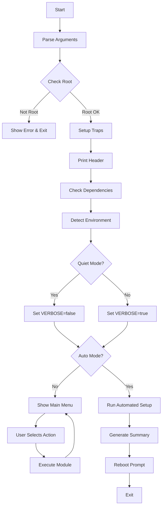

# План реорганизации проекта

## Цель
Сохранить модульную структуру проекта, но перенять лучшие практики из эталонной архитектуры:
- Улучшенное логирование
- Система аргументов командной строки
- Глобальная конфигурация
- Main flow с последовательным выполнением
- Обработка ошибок через trap

## Архитектура эталонного скрипта (для изучения)

```
du_setup.sh (6209 строк, монолит)
├── Глобальные переменные (строки 109-178)
├── Цвета и вывод (строки 119-137, 264-315)
├── Логирование (строки 266-305)
├── Парсинг аргументов (строки 222-231)
├── detect_environment() (строки 337-514)
├── cleanup_provider_packages() (строки 516-1096)
├── configure_custom_bashrc() (строки 1098-1499)
├── ... (другие функции настройки)
├── main() (строки 6110-6205)
│   ├── check_dependencies
│   ├── check_system
│   ├── run_update_check
│   ├── collect_config
│   ├── install_packages
│   ├── setup_user
│   ├── configure_system
│   ├── configure_firewall
│   ├── configure_fail2ban / configure_crowdsec
│   ├── configure_ssh
│   ├── configure_2fa
│   ├── configure_auto_updates
│   ├── configure_kernel_hardening
│   ├── install_docker
│   ├── install_tailscale
│   ├── install_netbird
│   ├── setup_backup
│   ├── configure_swap
│   ├── configure_security_audit
│   ├── cleanup_provider_packages
│   ├── final_cleanup
│   └── generate_summary
└── main "$@" (строка 6208)
```

## Текущая структура проекта

```
script/
├── server-setup.sh          # Главный скрипт (меню)
├── install.sh               # Скрипт установки
├── modules/
│   ├── core/
│   │   ├── common.sh       # Базовые функции (цвета, логирование, UI)
│   │   └── environment.sh  # Определение окружения
│   └── security/
│       ├── system_update.sh # Обновление системы
│       └── mirror_check.sh # Управление зеркалами APT
└── docs/
    └── du_setup.sh         # Эталонная архитектура (для изучения)
```

## План реализации

### Этап 1: Обновление ядра (modules/core/common.sh)

**Задачи:**
1. **Улучшить систему цветов и вывода**
   - Добавить поддержку `tput`
   - Добавить функции: `print_header()`, `print_section()`, `print_success()`, `print_separator()`
   - Сохранить текущие функции: `info()`, `ok()`, `warn()`, `err()`

2. **Улучшить логирование**
   - Добавить переменную `VERBOSE` для управления выводом
   - Добавить функцию `log()` с записью в файл
   - Добавить `REPORT_FILE` для генерации отчетов

3. **Добавить глобальные переменные конфигурации**
   ```bash
   SCRIPT_DIR="$(cd "$(dirname "${BASH_SOURCE[0]}")/../.." && pwd)"
   LOG_FILE="/var/log/server-setup.log"
   REPORT_FILE="/var/log/server-setup_report_$(date +%Y%m%d_%H%M%S).txt"
   BACKUP_DIR="/root/setup_backup_$(date +%Y%m%d_%H%M%S)"
   VERBOSE=true
   ```

4. **Добавить обработку ошибок**
   - Функция `handle_error()` с использованием `trap`
   - Trap для очистки временных файлов при EXIT

### Этап 2: Парсинг аргументов (server-setup.sh)

**Задачи:**
1. Добавить обработку аргументов командной строки:
   - `--quiet` - тихий режим (подавить некритичный вывод)
   - `--auto` - автоматический режим
   - `--help` / `-h` - показать справку
   - `--version` - показать версию

2. Добавить функцию `show_usage()` с описанием скрипта

3. Проверка прав root с улучшенным выводом

### Этап 3: Main Flow (server-setup.sh)

**Задачи:**
1. Создать функцию `main()` с последовательностью шагов:
   ```bash
   main() {
       trap 'handle_error $LINENO' ERR
       trap 'cleanup_temp_files' EXIT
       
       check_root
       print_header
       
       # Проверка зависимостей
       check_dependencies
       
       # Основной цикл меню или автоматический режим
       if [[ "$AUTO_MODE" == "true" ]]; then
           run_automated_setup
       else
           show_main_menu
       fi
   }
   ```

2. Добавить функцию `check_dependencies()` для проверки наличия необходимых утилит

3. Добавить функцию `collect_config()` для сбора начальной конфигурации

### Этап 4: Обновление модулей

**Задачи для каждого модуля (system_update.sh, mirror_check.sh, и будущих):**

1. **Стандартизация заголовков модулей**
   - Использовать единый формат `@menu.manifest`
   - Добавить метаданные модуля (версия, описание)

2. **Добавить поддержку тихого режима**
   - Все функции вывода должны проверять `$VERBOSE`
   - При `VERBOSE=false` выводить только ошибки

3. **Улучшить обработку ошибок в модулях**
   - Использовать `run_cmd` с проверкой ошибок
   - Логировать все действия

### Этап 5: Environment Detection (modules/core/environment.sh)

**Задачи:**
1. Создать модуль с функцией `detect_environment()`
2. Определять тип виртуализации (KVM, VMware, Docker и т.д.)
3. Определять провайдера (Hetzner, DigitalOcean и т.д.)
4. Определять тип окружения (commercial-cloud, personal-vm, bare-metal)

### Этап 6: Интеграция с install.sh

**Задачи:**
1. Обновить `install.sh` для поддержки новых путей
2. Убедиться, что симлинк указывает на обновленный `server-setup.sh`
3. Добавить создание необходимых директорий при установке

## Mermaid диаграмма основного потока



## Приоритеты реализации

1. **Высокий приоритет (сделать в первую очередь):**
   - [x] Обновить `common.sh` (цвета, логирование, глобальные переменные)
   - [x] Добавить парсинг аргументов в `server-setup.sh`
   - [x] Создать функцию `main()` в `server-setup.sh`

2. **Средний приоритет:**
   - [x] Создать модуль `environment.sh`
   - [x] Обновить существующие модули для поддержки `$VERBOSE`
   - [x] Добавить `handle_error()` и trap

3. **Низкий приоритет:**
   - [ ] Добавить генерацию отчетов (`REPORT_FILE`)
   - [ ] Добавить больше опций командной строки
   - [ ] Расширить `install.sh`

## Критерии успеха

1. Скрипт `server-setup.sh` поддерживает аргументы `--help`, `--quiet`
2. Логирование работает с разными уровнями вывода
3. Модули можно вызывать как из меню, так и последовательно
4. Обработка ошибок через `trap` работает корректно
5. Сохранена модульная структура (легко добавлять новые модули)
6. В файлах проекта отсутствуют упоминания эталонного скрипта
