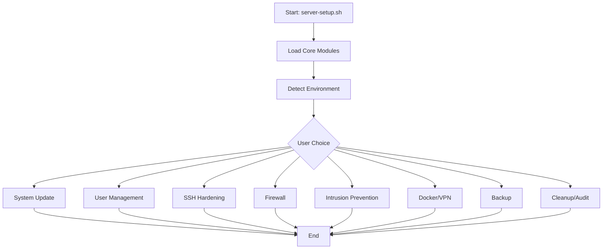

# План развития модулей

## Цель
Создать новые модули для расширения функциональности Server Setup, следуя стандартам `docs/STYLE_GUIDE.md` и `docs/GUIDE_MODULES.md`.

## 1. Новые модули для создания

На основе анализа лучших практик безопасности Linux, предлагается создать следующие модули:

### Модули безопасности (`modules/security/`)
1.  **`user_management.sh`**
    *   **Функции:** `setup_user`, `setup_ssh_keys`.
    *   **Описание:** Создание пользователей, настройка SSH-ключей, управление sudo-правами.
    *   **Манифест:** Добавить в меню "Безопасность" (security).
2.  **`ssh_hardening.sh`**
    *   **Функции:** `configure_ssh`, `configure_2fa`.
    *   **Описание:** Жесткая настройка SSH (порт, RootLogin), настройка двухфакторной аутентификации.
    *   **Манифест:** Добавить в меню "Безопасность".
3.  **`firewall.sh`**
    *   **Функции:** `configure_firewall`.
    *   **Описание:** Настройка UFW, открытие портов, IPv6 поддержка.
    *   **Манифест:** Добавить в меню "Безопасность".
4.  **`intrusion_prevention.sh`**
    *   **Функции:** `configure_fail2ban`, `configure_crowdsec`.
    *   **Описание:** Выбор и настройка систем защиты от брутфорса (Fail2Ban или CrowdSec).
    *   **Манифест:** Добавить в меню "Безопасность".
5.  **`system_hardening.sh`**
    *   **Функции:** `configure_kernel_hardening`, `configure_system`.
    *   **Описание:** Настройка sysctl для безопасности ядра, настройка локали, таймзоны и hostname.
    *   **Манифест:** Добавить в меню "Система" (system).
6.  **`auto_updates.sh`**
    *   **Функции:** `configure_auto_updates`.
    *   **Описание:** Настройка автоматических обновлений безопасности.
    *   **Манифест:** Добавить в меню "Система".

### Сетевые модули (`modules/network/`)
7.  **`vpn_tools.sh`**
    *   **Функции:** `install_tailscale`, `install_netbird`.
    *   **Описание:** Установка и настройка VPN-клиентов (Tailscale/NetBird).
    *   **Манифест:** Добавить в меню "Сеть" (network).
8.  **`docker_setup.sh`**
    *   **Функции:** `install_docker`, `install_dtop_optional`.
    *   **Описание:** Установка Docker, настройка daemon.json, опциональная установка dtop.
    *   **Манифест:** Добавить в меню "Сеть" или "Сервисы".

### Системные модули (`modules/system/`)
9.  **`backup.sh`**
    *   **Функции:** `setup_backup`.
    *   **Описание:** Настройка автоматических бэкапов через rsync over SSH.
    *   **Манифест:** Добавить в меню "Система".
10. **`resources.sh`**
    *   **Функции:** `configure_swap`, `configure_swap_settings`, `configure_time_sync`.
    *   **Описание:** Управление Swap-файлами и синхронизация времени.
    *   **Манифест:** Добавить в меню "Система".
11. **`audit_cleanup.sh`**
    *   **Функции:** `configure_security_audit`, `cleanup_provider_packages`.
    *   **Описание:** Установка Lynis/Debsecan, очистка пакетов провайдера.
    *   **Манифест:** Добавить в меню "Безопасность" или "Система".

### Улучшение ядра (`modules/core/`)
12. **`bashrc_customizer.sh`**
    *   **Функции:** `configure_custom_bashrc`.
    *   **Описание:** Установка кастомного .bashrc для пользователей.
    *   **Манифест:** Добавить в меню "Система".

## 2. Улучшение существующих модулей

*   **`modules/security/system_update.sh`**: Добавить поддержку `VERBOSE` режима, улучшить обработку ошибок (проверка `apt` lock), добавить функцию `check_reboot_required` (уже есть, но можно расширить).
*   **`modules/security/mirror_check.sh`**: Добавить возможность автоматического определения геолокации для выбора зеркал, улучшить UI (использовать `printf_menu_option` вместо `echo`).

## 3. Структура директорий после реализации

```text
modules/
├── core/
│   ├── common.sh
│   ├── environment.sh
│   └── bashrc_customizer.sh (new)
├── security/
│   ├── system_update.sh
│   ├── mirror_check.sh
│   ├── user_management.sh (new)
│   ├── ssh_hardening.sh (new)
│   ├── firewall.sh (new)
│   ├── intrusion_prevention.sh (new)
│   └── system_hardening.sh (new)
├── network/
│   ├── vpn_tools.sh (new)
│   └── docker_setup.sh (new)
└── system/
    ├── auto_updates.sh (new)
    ├── backup.sh (new)
    ├── resources.sh (new)
    └── audit_cleanup.sh (new)
```

## 4. Mermaid диаграмма потока (Main Flow)



## 5. Приоритет реализации
1.  **Высокий:** `user_management.sh`, `ssh_hardening.sh` (критично для безопасности).
2.  **Средний:** `firewall.sh`, `intrusion_prevention.sh`, `system_hardening.sh`.
3.  **Низкий:** `docker_setup.sh`, `vpn_tools.sh`, `backup.sh`.
